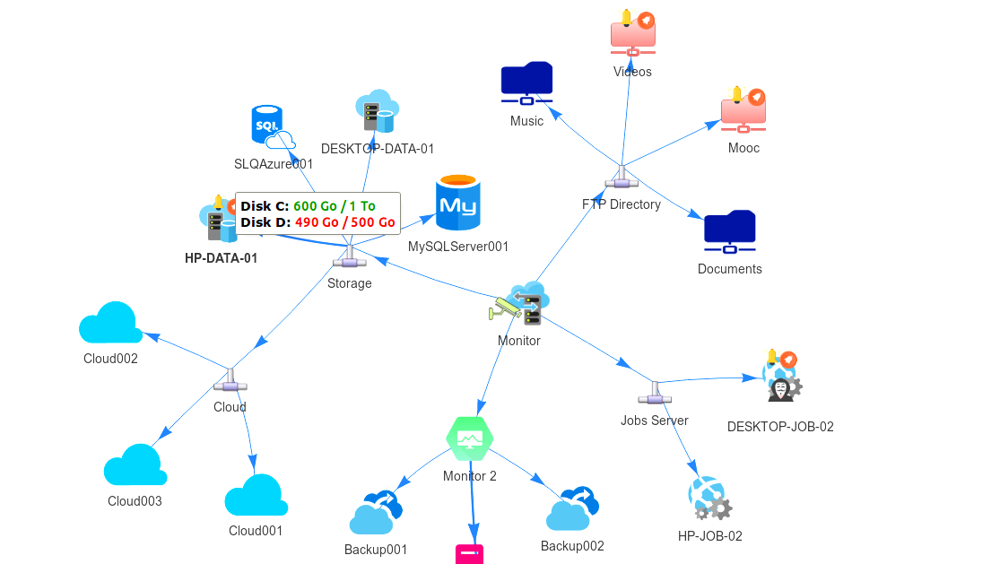

## Draw an interactive monitoring network using vis.js

See the [blog article](https://lioncoding.com/2019/02/09/2019-02-09-concevoir-un-reseau-de-monitoring-avec-vis-js/) and the [Demo](http://lioncoding.epizy.com/interactive-monitoring-network-demo)